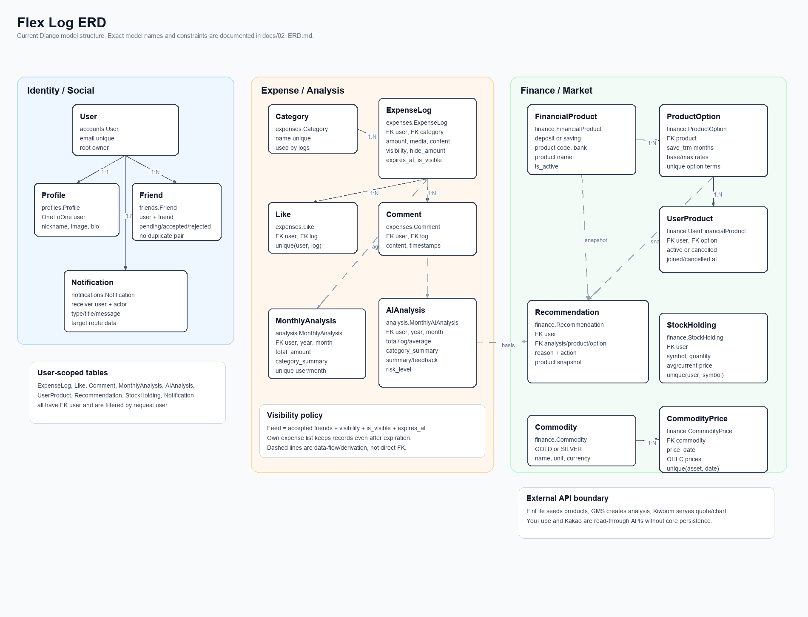
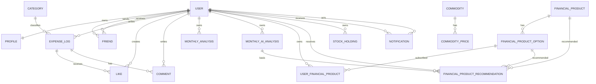

# 02. ERD

## 한눈에 보는 데이터 구조

Flex Log의 데이터는 `accounts.User`를 중심으로 확장됩니다. 사용자 1명은 프로필, 친구 관계, 소비 로그, 월별 분석, 금융 상품 가입, 주식 보유 종목, 알림을 각각 가집니다. 소비 로그는 피드와 분석의 원천 데이터이고, 월별 AI 분석 결과는 금융 상품 추천의 근거 데이터로 사용됩니다.

이미지 원본 SVG도 함께 보관합니다: [assets/flex_log_erd.svg](assets/flex_log_erd.svg)

## 도메인별 모델 요약

| 도메인 | 모델 | 역할 |
| --- | --- | --- |
| 인증 | `accounts.User` | 로그인 계정, 이메일, 이름, 생성/수정 시각 |
| 프로필 | `profiles.Profile` | 닉네임, 이미지, 자기소개 |
| 친구 | `friends.Friend` | 친구 요청자/수신자와 요청 상태 |
| 소비 | `expenses.Category` | 소비 카테고리 |
| 소비 | `expenses.ExpenseLog` | 소비 기록, 공개 범위, 미디어, 금액 숨김, 만료 |
| 소비 | `expenses.Like` | 소비 로그 좋아요 |
| 소비 | `expenses.Comment` | 소비 로그 댓글 |
| 분석 | `analysis.MonthlyAnalysis` | 월별 기본 집계 저장 |
| 분석 | `analysis.MonthlyAIAnalysis` | 월별 AI 분석 결과 저장 |
| 금융 | `finance.FinancialProduct` | 예금/적금 상품 기본 정보 |
| 금융 | `finance.FinancialProductOption` | 상품별 기간/금리 옵션 |
| 금융 | `finance.UserFinancialProduct` | 사용자의 상품 가입/취소 상태 |
| 금융 | `finance.FinancialProductRecommendation` | 분석 기반 추천 결과 |
| 금융 | `finance.Commodity` | 금/은 같은 원자재 마스터 |
| 금융 | `finance.CommodityPrice` | 원자재 일자별 가격 |
| 금융 | `finance.StockHolding` | 사용자별 보유 주식 |
| 알림 | `notifications.Notification` | 좋아요, 댓글, 친구 요청, 분석, 추천, 주가 변동 알림 |

## Mermaid ERD

문서 도구에서 Mermaid를 지원하면 아래 구조를 바로 렌더링할 수 있습니다. 별도 이미지 파일은 `docs/assets/flex_log_erd.png`와 `docs/assets/flex_log_erd.svg`에 있습니다.

## 모델 상세

### accounts.User

사용자 인증의 기준 모델입니다. Django `AbstractUser`를 확장하며, 모든 사용자별 데이터는 이 모델의 `id`를 기준으로 소유권을 분리합니다.

| 필드 | 타입 | 설명 |
| --- | --- | --- |
| `id` | BigAutoField | 기본 키 |
| `username` | CharField | 로그인 ID |
| `email` | EmailField(unique) | 이메일, 본인 프로필과 `/accounts/me/`에서만 직접 노출 |
| `name` | CharField | 사용자 실명 또는 표시 이름 |
| `created_at` | DateTimeField | 가입 시각 |
| `updated_at` | DateTimeField | 수정 시각 |

관계:

- `Profile`과 1:1
- `ExpenseLog`, `MonthlyAnalysis`, `MonthlyAIAnalysis`, `UserFinancialProduct`, `StockHolding`, `Notification`과 1:N
- `Friend`는 `user`, `friend` 두 FK로 같은 User 모델을 참조합니다.

### profiles.Profile

사용자의 공개 프로필입니다. 프로필 조회 API는 같은 serializer를 사용하지만, 요청자가 본인이 아닐 때는 이메일을 응답에서 제거합니다.

| 필드 | 타입 | 설명 |
| --- | --- | --- |
| `id` | BigAutoField | 기본 키 |
| `user` | OneToOne(User) | 프로필 소유자 |
| `nickname` | CharField(30) | 화면 표시 이름 우선순위 1 |
| `image` | ImageField | 프로필 이미지 |
| `bio` | TextField | 자기소개 |
| `created_at` | DateTimeField | 생성 시각 |
| `updated_at` | DateTimeField | 수정 시각 |

계산/응답 필드:

- `friend_count`: accepted 친구 관계 수
- `joined_products`: 본인 또는 친구에게만 보이는 활성 금융 상품 가입 목록
- `can_view_joined_products`: 가입 상품 조회 가능 여부

### friends.Friend

친구 관계와 친구 요청을 하나의 테이블에서 관리합니다.

| 필드 | 타입 | 설명 |
| --- | --- | --- |
| `id` | BigAutoField | 기본 키 |
| `user` | FK(User) | 요청자 |
| `friend` | FK(User) | 수신자 |
| `status` | CharField | `pending`, `accepted`, `rejected` |
| `created_at` | DateTimeField | 요청 생성 시각 |
| `updated_at` | DateTimeField | 상태 변경 시각 |

제약:

- `friend_prevent_self_request`: 자기 자신에게 친구 요청 불가
- `friend_valid_status`: 허용 상태값만 저장
- `friend_unique_request_pair`: 같은 방향 요청 중복 방지
- `clean()`: 역방향 중복 관계 방지

### expenses.Category

소비 로그 분류 기준입니다.

| 필드 | 타입 | 설명 |
| --- | --- | --- |
| `id` | BigAutoField | 기본 키 |
| `name` | CharField(unique) | 카테고리명 |
| `created_at` | DateTimeField | 생성 시각 |

### expenses.ExpenseLog

소비 피드와 월별 분석의 원천 데이터입니다. 미디어 파일을 직접 저장하는 `media`와 과거 호환용 `media_data` 계열 필드를 함께 둡니다.

| 필드 | 타입 | 설명 |
| --- | --- | --- |
| `id` | BigAutoField | 기본 키 |
| `user` | FK(User) | 작성자 |
| `category` | FK(Category, PROTECT) | 카테고리 |
| `title` | CharField(150) | 제목, 없으면 본문/오버레이/상품명/구매처 기반 자동 생성 |
| `media` | FileField | 업로드 파일 |
| `media_data` | BinaryField | 레거시 바이너리 미디어 |
| `media_content_type` | CharField | 레거시 미디어 MIME 타입 |
| `media_name` | CharField | 레거시 미디어 파일명 |
| `amount` | PositiveBigIntegerField | 소비 금액 |
| `product_name` | CharField | 상품명 |
| `merchant` | CharField | 구매처 |
| `content` | TextField | 본문 |
| `overlay_text` | CharField | 이미지 위 문구 |
| `overlay_style` | JSONField | 오버레이 스타일 |
| `visibility` | CharField | `public`, `friends`, `private` |
| `hide_amount` | BooleanField | 작성자가 아닌 사용자에게 금액 숨김 |
| `expires_at` | DateTimeField | 피드 노출 만료 시각, 기본 24시간 |
| `is_visible` | BooleanField | 피드 노출 여부 |
| `created_at` | DateTimeField | 생성 시각 |
| `updated_at` | DateTimeField | 수정 시각 |

제약과 인덱스:

- `expense_log_amount_positive`: 금액은 0보다 커야 합니다.
- `expense_log_valid_visibility`: 공개 범위는 `public`, `friends`, `private`만 허용합니다.
- `(user, -created_at)`, `(category, -created_at)`, `(visibility, is_visible, -created_at)` 인덱스를 사용합니다.

조회 정책:

- 본인 목록: 작성자 본인의 모든 로그를 조회합니다.
- 피드: 본인과 accepted 친구의 `public`, `friends` 로그 중 `is_visible=true`이고 `expires_at`이 지나지 않은 로그만 조회합니다.
- 타인 목록/상세: `accessible_log_queryset()`을 통해 공개 범위, 친구 관계, 만료 여부를 검사합니다.
- 수정/삭제: 작성자 본인 로그로 제한합니다.

### expenses.Like

| 필드 | 타입 | 설명 |
| --- | --- | --- |
| `id` | BigAutoField | 기본 키 |
| `user` | FK(User) | 좋아요 사용자 |
| `log` | FK(ExpenseLog) | 대상 소비 로그 |
| `created_at` | DateTimeField | 생성 시각 |

제약:

- `expense_like_unique_user_log`: 한 사용자는 같은 로그에 좋아요를 하나만 만들 수 있습니다.

### expenses.Comment

| 필드 | 타입 | 설명 |
| --- | --- | --- |
| `id` | BigAutoField | 기본 키 |
| `user` | FK(User) | 작성자 |
| `log` | FK(ExpenseLog) | 대상 소비 로그 |
| `content` | TextField | 댓글 내용 |
| `created_at` | DateTimeField | 작성 시각 |
| `updated_at` | DateTimeField | 수정 시각 |

정책:

- 댓글 작성은 접근 가능한 로그에서만 가능합니다.
- 댓글 수정/삭제는 댓글 작성자 본인으로 제한됩니다.

### analysis.MonthlyAnalysis

월별 기본 집계 결과입니다. GET `/analysis/monthly/` 호출 시 현재 로그를 집계한 뒤 upsert됩니다.

| 필드 | 타입 | 설명 |
| --- | --- | --- |
| `id` | BigAutoField | 기본 키 |
| `user` | FK(User) | 분석 소유자 |
| `year` | PositiveSmallIntegerField | 연도 |
| `month` | PositiveSmallIntegerField | 월 |
| `total_amount` | PositiveBigIntegerField | 월 총 소비 금액 |
| `category_summary` | JSONField | `{카테고리명: 금액}` 형식 |
| `created_at` | DateTimeField | 생성 시각 |
| `updated_at` | DateTimeField | 수정 시각 |

제약:

- `(user, year, month)` 고유
- `month`는 1부터 12까지
- `total_amount`는 0 이상

### analysis.MonthlyAIAnalysis

AI 분석 결과입니다. POST `/analysis/monthly/` 호출 시 GMS API를 시도하고, 실패하면 서버 fallback 문구를 저장합니다.

| 필드 | 타입 | 설명 |
| --- | --- | --- |
| `id` | BigAutoField | 기본 키 |
| `user` | FK(User) | 분석 소유자 |
| `year` | PositiveSmallIntegerField | 연도 |
| `month` | PositiveSmallIntegerField | 월 |
| `total_amount` | PositiveBigIntegerField | 월 총 소비 금액 |
| `log_count` | PositiveIntegerField | 분석 대상 로그 수 |
| `average_amount` | PositiveBigIntegerField | 로그당 평균 소비 금액 |
| `category_summary` | JSONField | `{카테고리명: {total, count}}` 형식 |
| `summary` | TextField | 소비 요약 |
| `problem` | TextField | 주요 문제점 |
| `feedback` | TextField | 개선 피드백 |
| `saving_tip` | TextField | 절약 팁 |
| `risk_level` | CharField | `low`, `medium`, `high` |
| `created_at` | DateTimeField | 생성 시각 |

제약:

- 월, 총액, 로그 수, 평균 금액, 위험도 값 검증
- `(user, -created_at)`, `(user, year, month)` 인덱스

### finance.FinancialProduct

금융감독원 FinLife 상품의 기본 정보입니다.

| 필드 | 타입 | 설명 |
| --- | --- | --- |
| `id` | BigAutoField | 기본 키 |
| `product_type` | CharField | `deposit`, `saving` |
| `fin_prdt_cd` | CharField | 금융상품 코드 |
| `dcls_month` | CharField | 공시 월 |
| `kor_co_nm` | CharField | 금융회사명 |
| `fin_prdt_nm` | CharField | 상품명 |
| `join_way` | TextField | 가입 방법 |
| `mtrt_int` | TextField | 만기 후 이자 |
| `spcl_cnd` | TextField | 우대 조건 |
| `join_deny` | CharField | 가입 제한 |
| `join_member` | TextField | 가입 대상 |
| `etc_note` | TextField | 기타 유의사항 |
| `max_limit` | BigIntegerField | 최고 한도 |
| `is_active` | BooleanField | 서비스 노출 여부 |
| `fetched_at` | DateTimeField | 마지막 수집/수정 시각 |
| `created_at` | DateTimeField | 생성 시각 |

제약:

- `(product_type, fin_prdt_cd)` 고유
- `(product_type, kor_co_nm)`, `fin_prdt_cd` 인덱스

### finance.FinancialProductOption

상품별 금리 옵션입니다.

| 필드 | 타입 | 설명 |
| --- | --- | --- |
| `id` | BigAutoField | 기본 키 |
| `product` | FK(FinancialProduct) | 소속 상품 |
| `intr_rate_type` | CharField | 금리 유형 코드 |
| `intr_rate_type_nm` | CharField | 금리 유형명 |
| `save_trm` | PositiveSmallIntegerField | 저축 기간, 개월 |
| `intr_rate` | DecimalField | 기본 금리 |
| `intr_rate2` | DecimalField | 최고 우대 금리 |
| `rsrv_type` | CharField | 적립 유형 코드 |
| `rsrv_type_nm` | CharField | 적립 유형명 |
| `created_at` | DateTimeField | 생성 시각 |
| `updated_at` | DateTimeField | 수정 시각 |

제약:

- `(product, save_trm, intr_rate_type, rsrv_type)` 고유
- `save_trm`은 0보다 큼
- `intr_rate`, `intr_rate2`는 null 또는 0 이상
- `save_trm`, `intr_rate2` 인덱스

### finance.UserFinancialProduct

사용자의 관심/가입 금융 상품 상태입니다. 실제 금융기관 가입이 아니라 서비스 내부 상태입니다.

| 필드 | 타입 | 설명 |
| --- | --- | --- |
| `id` | BigAutoField | 기본 키 |
| `user` | FK(User) | 가입 사용자 |
| `option` | FK(FinancialProductOption, PROTECT) | 가입 옵션 |
| `status` | CharField | `active`, `cancelled` |
| `joined_at` | DateTimeField | 가입 처리 시각 |
| `cancelled_at` | DateTimeField | 취소 처리 시각 |
| `created_at` | DateTimeField | 생성 시각 |
| `updated_at` | DateTimeField | 수정 시각 |

제약:

- `(user, option)` 고유
- 상태값은 `active`, `cancelled`만 허용
- `active`는 `cancelled_at=null`, `cancelled`는 `cancelled_at` 필수
- `(user, status)` 인덱스

### finance.FinancialProductRecommendation

월별 AI 분석과 금융 상품 데이터를 연결한 추천 결과입니다. 상품 정보가 바뀌어도 과거 추천을 이해할 수 있도록 스냅샷 필드를 함께 저장합니다.

| 필드 | 타입 | 설명 |
| --- | --- | --- |
| `id` | BigAutoField | 기본 키 |
| `user` | FK(User) | 추천 대상 |
| `analysis` | FK(MonthlyAIAnalysis, SET_NULL) | 추천 근거 분석 |
| `product` | FK(FinancialProduct, SET_NULL) | 추천 상품 |
| `option` | FK(FinancialProductOption, SET_NULL) | 추천 옵션 |
| `title` | CharField | 추천 제목 |
| `description` | TextField | 추천 설명 |
| `reason` | TextField | 추천 사유 |
| `action_text` | CharField | 버튼/행동 문구 |
| `bank_name` | CharField | 금융회사명 스냅샷 |
| `product_name` | CharField | 상품명 스냅샷 |
| `product_type` | CharField | 상품 유형 스냅샷 |
| `save_trm` | PositiveSmallIntegerField | 저축 기간 스냅샷 |
| `interest_rate` | DecimalField | 기본 금리 스냅샷 |
| `max_interest_rate` | DecimalField | 최고 금리 스냅샷 |
| `ai_comment` | TextField | AI 코멘트 |
| `caution` | TextField | 유의사항 |
| `priority` | IntegerField | 노출 우선순위 |
| `created_at` | DateTimeField | 추천 생성 시각 |

### finance.Commodity / finance.CommodityPrice

원자재 마스터와 일자별 가격 데이터입니다.

| 모델 | 필드 | 설명 |
| --- | --- | --- |
| `Commodity` | `code`, `name`, `unit`, `currency`, `created_at` | `GOLD`, `SILVER`만 허용 |
| `CommodityPrice` | `commodity`, `price_date`, `close_price`, `open_price`, `high_price`, `low_price`, `source`, `created_at` | 일자별 가격 |

제약:

- `Commodity.code`는 고유하며 `GOLD`, `SILVER`만 허용합니다.
- `CommodityPrice`는 `(commodity, price_date)`가 고유합니다.
- 모든 가격은 null 허용 필드를 제외하고 0 이상이어야 합니다.

### finance.StockHolding

사용자별 보유 주식입니다. 보유 수량과 가격을 저장하고 평가 금액/손익/수익률은 property와 serializer에서 계산합니다.

| 필드 | 타입 | 설명 |
| --- | --- | --- |
| `id` | BigAutoField | 기본 키 |
| `user` | FK(User) | 보유 사용자 |
| `symbol` | CharField | 종목 코드, 대문자 정규화 |
| `name` | CharField | 종목명 |
| `quantity` | DecimalField | 보유 수량 |
| `average_price` | DecimalField | 평균 단가 |
| `current_price` | DecimalField | 현재가 |
| `memo` | TextField | 사용자 메모 |
| `created_at` | DateTimeField | 생성 시각 |
| `updated_at` | DateTimeField | 수정 시각 |

계산 필드:

- `invested_amount = quantity * average_price`
- `valuation_amount = quantity * current_price`
- `profit_loss = valuation_amount - invested_amount`
- `profit_rate = profit_loss / invested_amount * 100`

제약:

- `(user, symbol)` 고유
- 수량은 0보다 큼
- 평균 단가와 현재가는 0 이상
- `(user, symbol)` 인덱스

### notifications.Notification

서비스 이벤트를 사용자에게 보여주는 알림입니다.

| 필드 | 타입 | 설명 |
| --- | --- | --- |
| `id` | BigAutoField | 기본 키 |
| `user` | FK(User) | 수신자 |
| `actor` | FK(User, SET_NULL) | 행위자 |
| `notification_type` | CharField | `like`, `comment`, `ai_analysis`, `friend_request`, `stock_movement`, `product_recommendation` |
| `title` | CharField | 알림 제목 |
| `message` | CharField | 알림 내용 |
| `target_route` | CharField | Vue Router route name |
| `target_params` | JSONField | 라우트 params |
| `target_query` | JSONField | 라우트 query |
| `dedupe_key` | CharField | 중복 알림 묶음 키 |
| `is_read` | BooleanField | 읽음 여부 |
| `read_at` | DateTimeField | 읽은 시각 |
| `created_at` | DateTimeField | 생성 시각 |

인덱스:

- `(user, is_read, -created_at)`
- `(user, dedupe_key)`

## 주요 데이터 흐름

### 소비 기록에서 분석까지

1. 사용자가 소비 로그를 작성합니다.
2. 로그는 `ExpenseLog`에 저장되고 `Category`와 연결됩니다.
3. GET `/analysis/monthly/`는 해당 월의 `ExpenseLog`를 집계해 `MonthlyAnalysis`를 upsert합니다.
4. POST `/analysis/monthly/`는 같은 집계 데이터에 `monthly_income`을 더해 AI 분석을 생성합니다.
5. AI 결과는 `MonthlyAIAnalysis`로 저장되고 `ai_analysis` 알림이 생성됩니다.

### 분석에서 금융 상품 추천까지

1. 사용자가 추천 생성을 요청합니다.
2. 서버는 최신 `MonthlyAIAnalysis`와 활성 `FinancialProductOption`을 기반으로 추천 후보를 만듭니다.
3. 추천 결과는 `FinancialProductRecommendation`에 저장됩니다.
4. 사용자는 `option_id`로 `UserFinancialProduct`를 생성해 관심/가입 상태를 관리합니다.

### 친구와 피드 공개 범위

1. 친구 요청은 `Friend(status=pending)`으로 생성됩니다.
2. 수신자가 수락하면 `status=accepted`가 됩니다.
3. 피드 조회는 accepted 친구 ID 목록을 만든 뒤 `ExpenseLog.visibility`, `is_visible`, `expires_at` 조건을 함께 적용합니다.
4. `hide_amount=true`인 로그는 작성자가 아닌 사용자에게 `amount=null`로 응답합니다.

### 주식 보유와 차트

1. 사용자는 `StockHolding`을 생성합니다.
2. 같은 `symbol`을 추가하면 새 row를 만들지 않고 수량과 평균 단가를 재계산합니다.
3. GET `/finance/stocks/?refresh=1`일 때만 Kiwoom 현재가 갱신을 시도합니다.
4. 차트 데이터는 GET `/finance/chart/?symbol=...&period=...`로 조회하고 프론트엔드 차트 인스턴스가 종목 변경 시 재생성됩니다.

## 설계상 중요한 경계

- 이메일은 인증 사용자 본인에게만 노출합니다.
- 친구 검색은 이메일을 검색하지 않습니다.
- 피드 공개 범위 판정은 프론트엔드가 아니라 백엔드 queryset에서 수행합니다.
- 월 수입은 DB 전역 설정으로 저장하지 않고 프론트엔드에서 사용자별 localStorage key로 관리한 뒤 요청마다 전달합니다.
- 외부 API 응답은 상품, 원자재, 추천, 주식 현재가 등 필요한 도메인 데이터로 정규화합니다.
