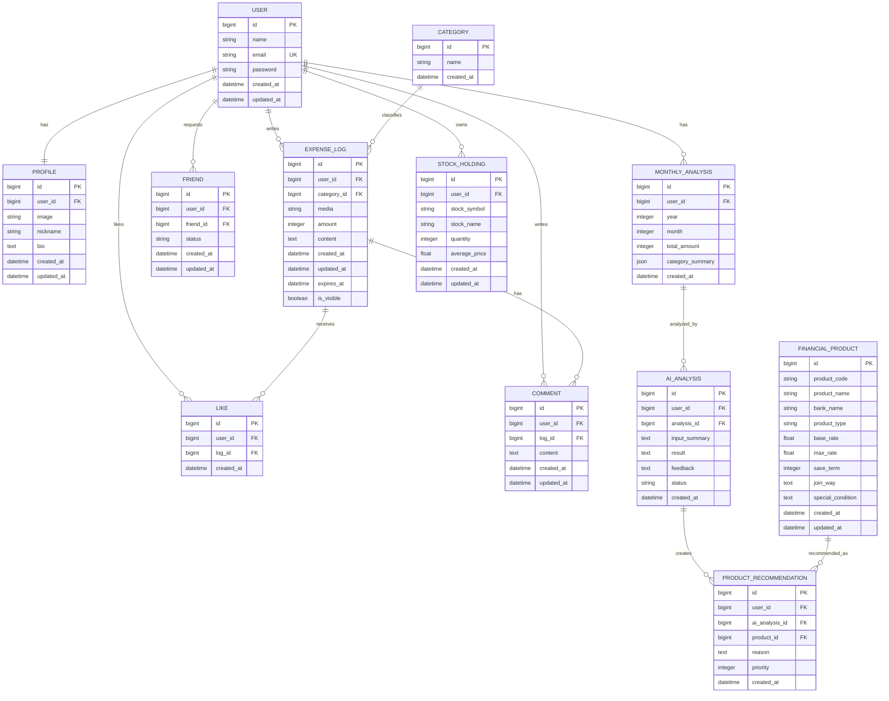
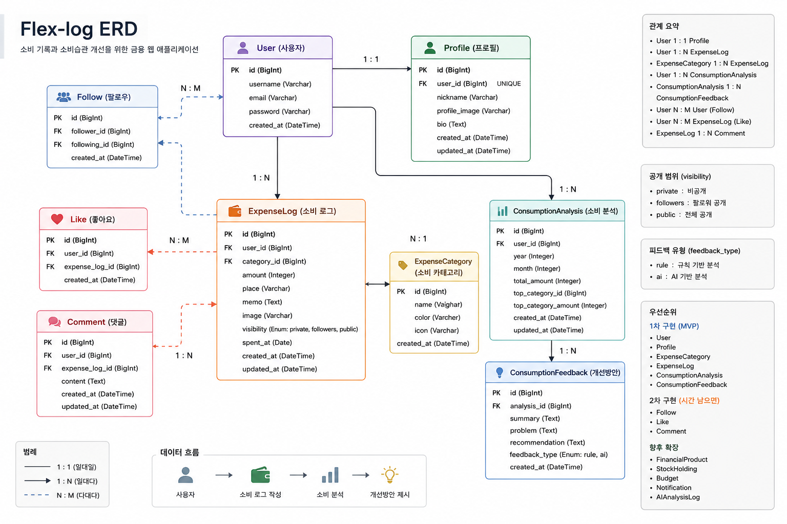

# 02. ERD 설계

## 1. 문서 개요

본 문서는 Flex-log 프로젝트의 데이터 구조와 엔티티 간 관계를 정리한 ERD 설계 문서이다.

Flex-log는 사용자가 소비를 SNS 방식으로 기록하고, 기록된 소비 데이터를 기반으로 AI 분석을 수행한 뒤, 외부 금융상품 API를 활용하여 사용자에게 적합한 금융상품을 추천하는 금융 웹 애플리케이션이다.

서비스의 핵심 흐름은 다음과 같다.

```text
소비 기록 → AI 소비 분석 → 금융상품 추천
```

따라서 데이터 구조는 다음 흐름을 중심으로 설계한다.

```text
사용자
  → 소비 로그 작성
  → 소비 데이터 누적
  → 월별·카테고리별 소비 분석
  → AI 분석 결과 저장
  → 금융상품 추천
```

---

## 2. ERD 설계 방향

Flex-log의 ERD는 다음 기준을 바탕으로 설계하였다.

| 설계 기준       | 설명                                             |
| ----------- | ---------------------------------------------- |
| 소비 로그 중심 설계 | 사용자의 소비 기록이 서비스의 핵심 데이터이므로 ExpenseLog를 중심으로 설계 |
| 사용자 데이터 분리  | User는 인증 정보, Profile은 사용자 소개 정보로 분리            |
| 친구 기반 공개 범위 | 소비 로그는 전체 공개가 아니라 친구 관계인 사용자에게만 공개             |
| 24시간 피드 노출  | 소비 로그는 24시간 후 DB에서 삭제하지 않고 피드에서만 숨김            |
| 분석 데이터 유지   | 소비 로그 데이터는 월별·카테고리별 분석에 계속 사용                  |
| AI 분석 결과 저장 | AI 분석 결과를 별도 테이블로 저장하여 재조회 가능하도록 설계            |
| 금융상품 추천 분리  | 외부 API로 가져온 금융상품과 추천 결과를 별도 테이블로 관리            |

---

## 3. 전체 엔티티 목록

Flex-log의 주요 엔티티는 다음과 같다.

| 엔티티                   | 설명                  | 우선순위 |
| --------------------- | ------------------- | ---- |
| User                  | 회원 인증 및 기본 사용자 정보   | 필수   |
| Profile               | 사용자 프로필 정보          | 필수   |
| Friend                | 사용자 간 친구 요청 및 친구 관계 | 필수   |
| Category              | 소비 카테고리 정보          | 필수   |
| ExpenseLog            | 사용자가 작성한 소비 로그      | 필수   |
| Like                  | 소비 로그 좋아요 정보        | 선택   |
| Comment               | 소비 로그 댓글 정보         | 선택   |
| MonthlyAnalysis       | 월별 소비 분석 결과         | 필수   |
| AIAnalysis            | AI 소비 분석 결과         | 필수   |
| FinancialProduct      | 외부 API 기반 금융상품 정보   | 필수   |
| ProductRecommendation | 사용자별 금융상품 추천 결과     | 필수   |
| StockHolding          | 사용자 보유 주식 정보        | 후순위  |

이번 프로젝트의 핵심 ERD는 `User`, `Profile`, `Friend`, `Category`, `ExpenseLog`, `MonthlyAnalysis`, `AIAnalysis`, `FinancialProduct`, `ProductRecommendation`을 중심으로 설계한다.

---

## 4. ERD 개요

```text
[User]
  ├── [Profile]
  ├── [Friend]
  ├── [ExpenseLog]
  │       ├── [Category]
  │       ├── [Like]
  │       └── [Comment]
  │
  ├── [MonthlyAnalysis]
  │       └── [AIAnalysis]
  │               └── [ProductRecommendation]
  │                       └── [FinancialProduct]
  │
  └── [StockHolding]
```

---

## 5. Mermaid ERD

GitHub README 또는 Markdown에서 Mermaid가 지원되는 경우 아래 ERD를 활용할 수 있다.



---

# 6. 엔티티 상세 설계

## 6.1 User

회원 인증 및 기본 사용자 정보를 저장한다.

| 필드         | 타입       | 설명        |
| ---------- | -------- | --------- |
| id         | BIGINT   | 사용자 고유 ID |
| name       | VARCHAR  | 이름        |
| email      | VARCHAR  | 이메일       |
| password   | VARCHAR  | 비밀번호      |
| created_at | DATETIME | 생성 시간     |
| updated_at | DATETIME | 수정 시간     |

### 관계

| 관계                               | 설명                                |
| -------------------------------- | --------------------------------- |
| User 1 : 1 Profile               | 한 명의 사용자는 하나의 프로필을 가진다.           |
| User 1 : N ExpenseLog            | 한 명의 사용자는 여러 소비 로그를 작성할 수 있다.     |
| User 1 : N MonthlyAnalysis       | 한 명의 사용자는 여러 월별 분석 결과를 가질 수 있다.   |
| User 1 : N Friend                | 한 명의 사용자는 여러 친구 관계를 가질 수 있다.      |
| User 1 : N ProductRecommendation | 한 명의 사용자는 여러 금융상품 추천 결과를 받을 수 있다. |

---

## 6.2 Profile

사용자의 프로필 정보를 저장한다.

| 필드         | 타입              | 설명      |
| ---------- | --------------- | ------- |
| id         | BIGINT          | 프로필 ID  |
| user_id    | BIGINT          | 사용자 ID  |
| image      | IMAGE / VARCHAR | 프로필 이미지 |
| nickname   | VARCHAR         | 닉네임     |
| bio        | TEXT            | 자기소개    |
| created_at | DATETIME        | 생성 시간   |
| updated_at | DATETIME        | 수정 시간   |

### 설계 기준

프로필 테이블에는 사용자 소개와 관련된 정보만 저장한다.

다음 데이터는 프로필에 직접 저장하지 않고 별도 테이블로 분리한다.

| 데이터        | 분리 대상                 |
| ---------- | --------------------- |
| 월별 소비금액    | MonthlyAnalysis       |
| AI 분석 결과   | AIAnalysis            |
| 금융상품 추천 결과 | ProductRecommendation |
| 보유 주식 현황   | StockHolding          |

### 관계

```text
User 1 : 1 Profile
```

---

## 6.3 Friend

사용자 간 친구 요청 및 친구 관계를 저장한다.

Flex-log는 일반적인 팔로우/팔로워 구조가 아니라, 친구 요청을 보내고 상대방이 수락하면 서로 친구가 되는 양방향 친구 관계를 사용한다.

| 필드         | 타입       | 설명            |
| ---------- | -------- | ------------- |
| id         | BIGINT   | 친구 관계 ID      |
| user_id    | BIGINT   | 친구 요청을 보낸 사용자 |
| friend_id  | BIGINT   | 친구 요청을 받은 사용자 |
| status     | VARCHAR  | 친구 요청 상태      |
| created_at | DATETIME | 생성 시간         |
| updated_at | DATETIME | 수정 시간         |

### status 값

| 값        | 설명       |
| -------- | -------- |
| pending  | 친구 요청 대기 |
| accepted | 친구 요청 수락 |
| rejected | 친구 요청 거절 |

### 설계 규칙

```text
두 사용자 사이에는 하나의 친구 관계만 존재한다.
친구 요청이 수락되면 양방향 친구 관계로 간주한다.
status가 accepted인 경우에만 서로의 소비 로그를 조회할 수 있다.
```

### 관계

```text
User 1 : N Friend
User 1 : N Friend(friend_id 기준)
```

---

## 6.4 Category

소비 로그에 사용할 소비 카테고리를 저장한다.

| 필드         | 타입       | 설명      |
| ---------- | -------- | ------- |
| id         | BIGINT   | 카테고리 ID |
| name       | VARCHAR  | 카테고리명   |
| created_at | DATETIME | 생성 시간   |

### 기본 카테고리 예시

* 식비
* 교통비
* 문화생활
* 쇼핑
* 공과금
* 카페
* 구독
* 기타

### 관계

```text
Category 1 : N ExpenseLog
```

하나의 카테고리는 여러 소비 로그에 사용될 수 있다.

---

## 6.5 ExpenseLog

사용자가 작성한 소비 로그를 저장한다.

ExpenseLog는 Flex-log의 핵심 엔티티이다.

| 필드          | 타입                     | 설명          |
| ----------- | ---------------------- | ----------- |
| id          | BIGINT                 | 소비 로그 ID    |
| user_id     | BIGINT                 | 작성자 ID      |
| category_id | BIGINT                 | 카테고리 ID     |
| media       | IMAGE / FILE / VARCHAR | 이미지 또는 동영상  |
| amount      | INTEGER                | 소비 금액       |
| content     | TEXT                   | 소비 로그 텍스트   |
| created_at  | DATETIME               | 생성 시간       |
| updated_at  | DATETIME               | 수정 시간       |
| expires_at  | DATETIME               | 피드 노출 만료 시간 |
| is_visible  | BOOLEAN                | 피드 노출 여부    |

### 24시간 노출 처리

초기 아이디어에서는 소비 로그를 24시간 후 삭제하는 방향을 고려하였다.

하지만 소비 로그가 DB에서 삭제되면 월별 소비 분석과 카테고리별 소비 분석을 수행할 데이터가 사라진다.

따라서 실제 삭제가 아니라 피드에서만 숨기는 방식으로 설계한다.

```text
소비 로그는 24시간 후 DB에서 삭제하지 않는다.
친구 피드에서만 보이지 않게 처리한다.
분석 데이터로는 계속 유지한다.
```

이를 위해 `expires_at` 또는 `is_visible` 필드를 활용한다.

### 관계

| 관계                        | 설명                            |
| ------------------------- | ----------------------------- |
| User 1 : N ExpenseLog     | 한 사용자는 여러 소비 로그를 작성할 수 있다.    |
| Category 1 : N ExpenseLog | 하나의 카테고리는 여러 소비 로그에 연결될 수 있다. |
| ExpenseLog 1 : N Like     | 하나의 소비 로그는 여러 좋아요를 받을 수 있다.   |
| ExpenseLog 1 : N Comment  | 하나의 소비 로그는 여러 댓글을 가질 수 있다.    |

---

## 6.6 Like

소비 로그에 대한 좋아요 정보를 저장한다.

| 필드         | 타입       | 설명           |
| ---------- | -------- | ------------ |
| id         | BIGINT   | 좋아요 ID       |
| user_id    | BIGINT   | 좋아요를 누른 사용자  |
| log_id     | BIGINT   | 좋아요 대상 소비 로그 |
| created_at | DATETIME | 생성 시간        |

### 설계 규칙

```text
한 사용자는 하나의 소비 로그에 한 번만 좋아요를 누를 수 있다.
```

따라서 `user_id`와 `log_id`의 조합은 중복될 수 없다.

### 관계

```text
User 1 : N Like
ExpenseLog 1 : N Like
```

---

## 6.7 Comment

소비 로그에 작성된 댓글 정보를 저장한다.

| 필드         | 타입       | 설명          |
| ---------- | -------- | ----------- |
| id         | BIGINT   | 댓글 ID       |
| user_id    | BIGINT   | 댓글 작성자      |
| log_id     | BIGINT   | 댓글 대상 소비 로그 |
| content    | TEXT     | 댓글 내용       |
| created_at | DATETIME | 생성 시간       |
| updated_at | DATETIME | 수정 시간       |

### 설계 기준

댓글에는 반드시 댓글 내용을 저장하는 `content` 필드가 필요하다.

댓글 작성, 수정, 삭제는 작성자 본인만 가능하도록 설계한다.

### 관계

```text
User 1 : N Comment
ExpenseLog 1 : N Comment
```

---

## 6.8 MonthlyAnalysis

사용자의 월별 소비 분석 결과를 저장하거나 조회하기 위한 엔티티이다.

| 필드               | 타입       | 설명          |
| ---------------- | -------- | ----------- |
| id               | BIGINT   | 분석 ID       |
| user_id          | BIGINT   | 사용자 ID      |
| year             | INTEGER  | 분석 연도       |
| month            | INTEGER  | 분석 월        |
| total_amount     | INTEGER  | 월별 총 소비 금액  |
| category_summary | JSON     | 카테고리별 소비 요약 |
| created_at       | DATETIME | 생성 시간       |

### 설계 기준

초기에는 `ExpenseLog` 데이터를 조회하여 실시간으로 월별 소비금액과 카테고리별 소비금액을 계산할 수 있다.

다만 AI 분석과 금융상품 추천에 동일한 분석 데이터를 반복적으로 활용해야 하므로, 분석 결과를 `MonthlyAnalysis`에 저장하는 구조를 고려한다.

### category_summary 예시

```json
{
  "식비": 250000,
  "교통비": 70000,
  "카페": 85000,
  "쇼핑": 180000
}
```

### 관계

```text
User 1 : N MonthlyAnalysis
MonthlyAnalysis 1 : N AIAnalysis
```

---

## 6.9 AIAnalysis

AI 소비 분석 결과를 저장한다.

사용자의 월별 소비 분석 데이터를 AI API에 전달하고, 그 결과를 저장한다.

| 필드            | 타입       | 설명                |
| ------------- | -------- | ----------------- |
| id            | BIGINT   | AI 분석 ID          |
| user_id       | BIGINT   | 사용자 ID            |
| analysis_id   | BIGINT   | 월별 분석 ID          |
| input_summary | TEXT     | AI에 전달한 소비 요약 데이터 |
| result        | TEXT     | AI 분석 결과          |
| feedback      | TEXT     | 소비 습관 개선방안        |
| status        | VARCHAR  | 분석 상태             |
| created_at    | DATETIME | 생성 시간             |

### status 값

| 값        | 설명                   |
| -------- | -------------------- |
| success  | AI 분석 성공             |
| failed   | AI 분석 실패             |
| fallback | AI 실패 후 규칙 기반 피드백 제공 |

### 설계 기준

AI 분석은 필수 기능으로 설계한다.

다만 외부 API 호출 실패 가능성이 있으므로, 실패 시 규칙 기반 피드백을 제공할 수 있도록 `status` 값을 둔다.

### AI 분석 입력 데이터 예시

```text
분석 월
월별 총 소비 금액
카테고리별 소비 금액
카테고리별 소비 비율
가장 많이 소비한 카테고리
최근 소비 로그 요약
```

### 관계

```text
User 1 : N AIAnalysis
MonthlyAnalysis 1 : N AIAnalysis
AIAnalysis 1 : N ProductRecommendation
```

---

## 6.10 FinancialProduct

외부 금융상품 API를 통해 가져온 예금 또는 적금 상품 정보를 저장한다.

| 필드                | 타입       | 설명       |
| ----------------- | -------- | -------- |
| id                | BIGINT   | 금융상품 ID  |
| product_code      | VARCHAR  | 금융상품 코드  |
| product_name      | VARCHAR  | 금융상품명    |
| bank_name         | VARCHAR  | 금융회사명    |
| product_type      | VARCHAR  | 상품 유형    |
| base_rate         | FLOAT    | 기본 금리    |
| max_rate          | FLOAT    | 최고 우대 금리 |
| save_term         | INTEGER  | 가입 기간    |
| join_way          | TEXT     | 가입 방법    |
| special_condition | TEXT     | 우대 조건    |
| created_at        | DATETIME | 생성 시간    |
| updated_at        | DATETIME | 수정 시간    |

### product_type 예시

| 값       | 설명 |
| ------- | -- |
| deposit | 예금 |
| saving  | 적금 |

### 설계 기준

금융상품 데이터는 외부 API에서 가져온 뒤 DB에 저장한다.

AI 분석 결과를 바탕으로 사용자에게 적합한 상품을 추천할 때 이 테이블의 데이터를 활용한다.

### 관계

```text
FinancialProduct 1 : N ProductRecommendation
```

---

## 6.11 ProductRecommendation

사용자별 금융상품 추천 결과를 저장한다.

AI 분석 결과와 금융상품 데이터를 연결하는 테이블이다.

| 필드             | 타입       | 설명         |
| -------------- | -------- | ---------- |
| id             | BIGINT   | 추천 ID      |
| user_id        | BIGINT   | 사용자 ID     |
| ai_analysis_id | BIGINT   | AI 분석 ID   |
| product_id     | BIGINT   | 추천 금융상품 ID |
| reason         | TEXT     | 추천 사유      |
| priority       | INTEGER  | 추천 우선순위    |
| created_at     | DATETIME | 생성 시간      |

### 설계 기준

AI 분석 결과를 바탕으로 금융상품을 추천하고, 왜 해당 상품이 적합한지 추천 사유를 함께 저장한다.

### 추천 예시

| 소비 분석 결과          | 추천 방향                |
| ----------------- | -------------------- |
| 소비가 많고 저축 비율이 낮음  | 소액으로 시작 가능한 적금 상품 추천 |
| 매월 일정 금액을 남길 수 있음 | 정기 적금 상품 추천          |
| 여유 자금이 있는 사용자     | 예금 상품 추천             |
| 단기 목표가 필요한 사용자    | 가입 기간이 짧은 상품 추천      |

### 관계

```text
User 1 : N ProductRecommendation
AIAnalysis 1 : N ProductRecommendation
FinancialProduct 1 : N ProductRecommendation
```

---

## 6.12 StockHolding

사용자의 보유 주식 정보를 저장한다.

해당 기능은 후순위 기능으로 분류한다.

| 필드            | 타입       | 설명       |
| ------------- | -------- | -------- |
| id            | BIGINT   | 보유 주식 ID |
| user_id       | BIGINT   | 사용자 ID   |
| stock_symbol  | VARCHAR  | 주식 심볼    |
| stock_name    | VARCHAR  | 주식명      |
| quantity      | INTEGER  | 보유 수량    |
| average_price | FLOAT    | 평균 매수가   |
| created_at    | DATETIME | 생성 시간    |
| updated_at    | DATETIME | 수정 시간    |

### 설계 기준

보유 주식 현황은 Flex-log의 확장 기능이다.

이번 MVP에서는 AI 소비 분석과 금융상품 추천을 우선 구현하고, 보유 주식 기능은 후순위로 둔다.

---

# 7. 주요 관계 정리

## 7.1 User 중심 관계

| 관계                               | 설명                         |
| -------------------------------- | -------------------------- |
| User 1 : 1 Profile               | 한 사용자는 하나의 프로필을 가진다.       |
| User 1 : N ExpenseLog            | 한 사용자는 여러 소비 로그를 작성할 수 있다. |
| User 1 : N Friend                | 한 사용자는 여러 친구 요청을 만들 수 있다.  |
| User 1 : N MonthlyAnalysis       | 한 사용자는 여러 월별 분석 결과를 가진다.   |
| User 1 : N AIAnalysis            | 한 사용자는 여러 AI 분석 결과를 가진다.   |
| User 1 : N ProductRecommendation | 한 사용자는 여러 금융상품 추천 결과를 가진다. |

---

## 7.2 ExpenseLog 중심 관계

| 관계                        | 설명                          |
| ------------------------- | --------------------------- |
| ExpenseLog N : 1 User     | 하나의 소비 로그는 한 명의 작성자를 가진다.   |
| ExpenseLog N : 1 Category | 하나의 소비 로그는 하나의 카테고리에 속한다.   |
| ExpenseLog 1 : N Like     | 하나의 소비 로그는 여러 좋아요를 받을 수 있다. |
| ExpenseLog 1 : N Comment  | 하나의 소비 로그는 여러 댓글을 가질 수 있다.  |

---

## 7.3 분석 및 추천 관계

| 관계                                           | 설명                                |
| -------------------------------------------- | --------------------------------- |
| MonthlyAnalysis N : 1 User                   | 하나의 월별 분석은 한 명의 사용자에 속한다.         |
| AIAnalysis N : 1 MonthlyAnalysis             | 하나의 AI 분석은 특정 월별 분석 데이터를 기반으로 한다. |
| ProductRecommendation N : 1 AIAnalysis       | 하나의 추천 결과는 특정 AI 분석 결과를 기반으로 한다.  |
| ProductRecommendation N : 1 FinancialProduct | 하나의 추천 결과는 하나의 금융상품을 참조한다.        |

---

# 8. 제약 조건

## 8.1 User 제약 조건

| 조건                | 설명              |
| ----------------- | --------------- |
| email unique      | 이메일은 중복될 수 없다.  |
| password required | 비밀번호는 필수 입력값이다. |

---

## 8.2 Friend 제약 조건

| 조건                         | 설명                                        |
| -------------------------- | ----------------------------------------- |
| user_id != friend_id       | 자기 자신에게 친구 요청을 보낼 수 없다.                   |
| user_id + friend_id unique | 두 사용자 사이에는 하나의 친구 관계만 존재한다.               |
| status 제한                  | pending, accepted, rejected 중 하나의 값만 가진다. |

---

## 8.3 ExpenseLog 제약 조건

| 조건                   | 설명                       |
| -------------------- | ------------------------ |
| amount > 0           | 소비 금액은 0보다 커야 한다.        |
| category_id required | 소비 로그는 반드시 카테고리를 가져야 한다. |
| user_id required     | 소비 로그는 반드시 작성자를 가져야 한다.  |
| expires_at required  | 피드 노출 만료 시간을 관리해야 한다.    |

---

## 8.4 Like 제약 조건

| 조건                      | 설명                                   |
| ----------------------- | ------------------------------------ |
| user_id + log_id unique | 한 사용자는 하나의 소비 로그에 한 번만 좋아요를 누를 수 있다. |

---

## 8.5 MonthlyAnalysis 제약 조건

| 조건                            | 설명                             |
| ----------------------------- | ------------------------------ |
| user_id + year + month unique | 한 사용자의 특정 연월 분석 데이터는 하나만 존재한다. |

---

## 8.6 FinancialProduct 제약 조건

| 조건                  | 설명                               |
| ------------------- | -------------------------------- |
| product_code unique | 외부 API에서 가져온 상품 코드는 중복 저장하지 않는다. |

---

# 9. MVP 기준 ERD 범위

2주 프로젝트의 MVP 기준으로 반드시 구현할 엔티티는 다음과 같다.

| 엔티티                   | 구현 여부 |
| --------------------- | ----- |
| User                  | 필수    |
| Profile               | 필수    |
| Friend                | 필수    |
| Category              | 필수    |
| ExpenseLog            | 필수    |
| MonthlyAnalysis       | 필수    |
| AIAnalysis            | 필수    |
| FinancialProduct      | 필수    |
| ProductRecommendation | 필수    |
| Like                  | 선택    |
| Comment               | 선택    |
| StockHolding          | 후순위   |

---

# 10. ERD 설계 정리

Flex-log의 ERD는 `ExpenseLog`를 중심으로 구성된다.

사용자는 소비 로그를 작성하고, 소비 로그는 카테고리와 연결된다.
소비 로그 데이터는 월별 소비 분석의 기준 데이터가 되며, 월별 분석 결과는 AI 분석에 활용된다.
AI 분석 결과는 사용자의 소비 습관 개선방안과 금융상품 추천으로 이어진다.

핵심 데이터 흐름은 다음과 같다.

```text
User
  → ExpenseLog
  → MonthlyAnalysis
  → AIAnalysis
  → ProductRecommendation
  → FinancialProduct
```

또한 소비 로그는 SNS 방식으로 친구에게 노출되지만, 금융 데이터의 민감성을 고려하여 친구 관계가 수락된 사용자에게만 공개된다.

24시간이 지난 소비 로그는 피드에서만 숨기고, DB에서는 삭제하지 않는다.
이를 통해 SNS 스토리와 같은 사용자 경험을 제공하면서도, 소비 분석과 AI 분석에 필요한 데이터를 유지할 수 있다.

최종적으로 Flex-log의 데이터 구조는 다음 세 가지 목적을 만족하도록 설계하였다.

```text
1. 소비를 쉽게 기록할 수 있는 구조
2. 기록된 소비를 분석할 수 있는 구조
3. 분석 결과를 금융상품 추천으로 연결할 수 있는 구조
```


