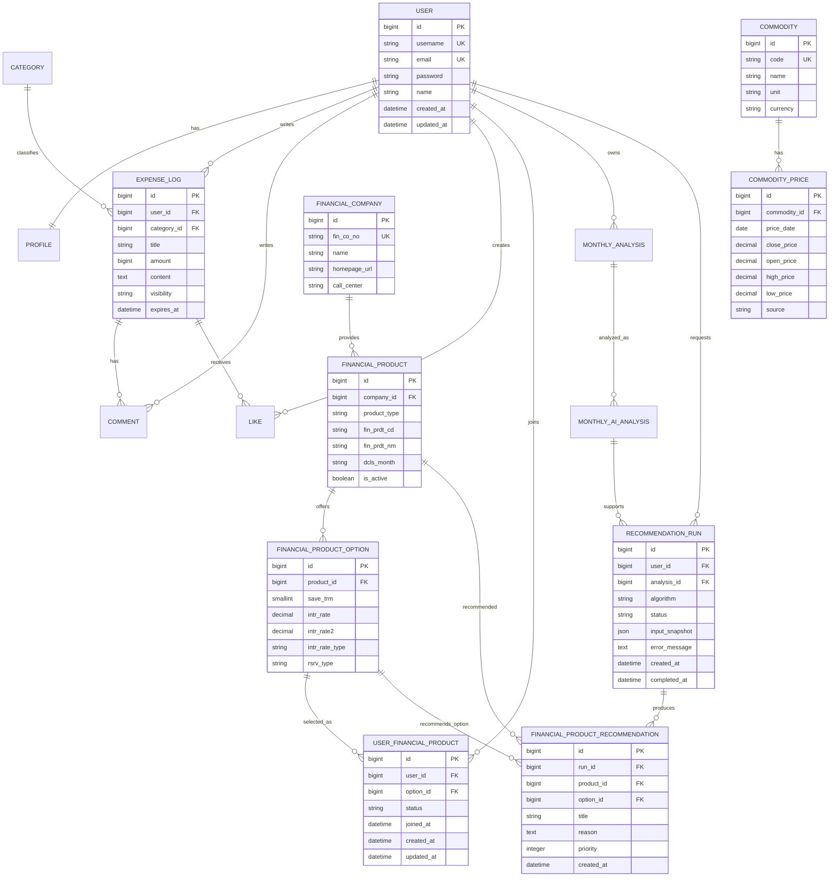

# 필수 기능 완성을 위한 DB 구조 개선안

## 1. 문서 목적

이 문서는 `(26_0622) 관통템플릿_[파이썬]_[금융]_[15기]_[13회차].pdf`의 필수 기능을 현재 Flex-log 데이터 모델로 완전히 구현하기 위해 필요한 DB 변경사항을 정의한다.

검토 대상은 현재 코드에 존재하는 다음 모델이다.

- `accounts.User`
- `profiles.Profile`
- `friends.Friend`
- `expenses.Category`, `ExpenseLog`, `Like`, `Comment`
- `analysis.MonthlyAnalysis`, `MonthlyAIAnalysis`
- `finance.FinancialProduct`, `FinancialProductOption`, `FinancialProductRecommendation`, `StockHolding`

DB에 저장할 필요가 없는 외부 API의 일시적 응답은 테이블로 만들지 않는다. YouTube 검색 결과와 Kakao 지도 주변 은행 검색 결과는 프론트엔드 또는 백엔드 API에서 즉시 사용하고 폐기하는 것을 기본 원칙으로 한다.

---

## 2. 필수 요구사항별 DB 영향

| 요구사항 | 현재 구조 | 필요한 조치 | 우선순위 |
|---|---|---|---|
| F1301 메인 페이지 | DB 비의존 | DB 변경 없음 | 없음 |
| F1302 회원 커스터마이징 | Custom User와 Profile 존재 | 가입 금융상품 관계 추가 | 필수 |
| F1303-1 예적금 저장 | 상품·옵션 모델과 중복 방지 존재 | 금융회사 코드 저장, 금리 자료형 개선 권장 | 권장 |
| F1303-2 예적금 목록 | 상품·옵션으로 조회 가능 | 은행 FK 및 검색 인덱스 권장 | 권장 |
| F1303-3 상품 상세·가입 | 사용자와 상품의 가입 관계 없음 | `UserFinancialProduct` 추가 | 필수 |
| F1304 금·은 시각화 | 시세 저장 모델 없음 | `Commodity`, `CommodityPrice` 추가 | 필수 |
| F1305 YouTube 검색·상세 | 관련 모델 없음 | 검색 결과를 저장하지 않으므로 DB 변경 없음 | 없음 |
| F1306 근처 은행 검색 | 관련 모델 없음 | Kakao API 실시간 조회이므로 DB 변경 없음 | 없음 |
| F1307 커뮤니티 | ExpenseLog·Comment CRUD 존재 | 게시글 제목 추가 또는 별도 게시글 모델 필요 | 필수 |
| F1308 프로필 | 기본 정보만 조회 가능 | 가입상품 관계를 프로필에서 조회하여 차트 생성 | 필수 |
| F1309 금융상품 추천 | 사용자별 추천 결과 존재 | 추천 옵션·실행 단위와 알고리즘 정보 추가 권장 | 권장 |

---

## 3. 현재 구조에서 반드시 수정할 사항

### 3.1 사용자의 가입 금융상품 관계 추가

현재 `User`와 `FinancialProduct` 사이에는 가입 관계가 없다. PDF는 Custom User에 가입 상품 목록을 제공하고, 상품 상세 화면의 가입 버튼으로 목록에 추가하며, 프로필에서 가입 상품과 금리 그래프를 출력하도록 요구한다.

단순 `ManyToManyField`만 추가하면 사용자가 선택한 가입 기간과 금리 옵션, 가입일을 보존할 수 없다. 따라서 중간 모델을 명시적으로 둔다.

권장 모델명은 `UserFinancialProduct`이며 다음 관계를 표현한다.

```text
User 1 ── N UserFinancialProduct N ── 1 FinancialProductOption
FinancialProduct 1 ── N FinancialProductOption
```

필수 필드:

| 필드 | Django 타입 | 제약/설명 |
|---|---|---|
| `id` | `BigAutoField` | PK |
| `user` | `ForeignKey(User)` | `CASCADE`, `related_name='joined_financial_products'` |
| `option` | `ForeignKey(FinancialProductOption)` | `PROTECT`; 사용자가 선택한 기간·금리 |
| `joined_at` | `DateTimeField` | 가입 목록에 추가한 시각 |
| `status` | `CharField` | `active`, `cancelled` |
| `cancelled_at` | `DateTimeField(null=True)` | 해지 시각 |
| `created_at` | `DateTimeField` | 생성 시각 |
| `updated_at` | `DateTimeField` | 수정 시각 |

제약조건:

- `UniqueConstraint(user, option)`: 같은 사용자가 같은 상품 옵션을 중복 가입하지 못하게 한다.
- `CheckConstraint(status IN ('active', 'cancelled'))`
- `active`이면 `cancelled_at`은 null이고, `cancelled`이면 해지 시각이 반드시 존재해야 한다.
- 상품 정보는 `option__product`로 조회하여 중복 FK를 두지 않는다.

### 3.2 금·은 시세 모델 추가

현재 금·은 가격 데이터셋을 저장하거나 기간별로 조회할 수 있는 모델이 없다. 자산 종류와 일별 시세를 분리한다.

#### Commodity

| 필드 | Django 타입 | 제약/설명 |
|---|---|---|
| `id` | `BigAutoField` | PK |
| `code` | `CharField(max_length=20)` | `unique=True`; `GOLD`, `SILVER` |
| `name` | `CharField(max_length=50)` | 표시 이름 |
| `unit` | `CharField(max_length=30)` | 예: `USD/troy oz` |
| `currency` | `CharField(max_length=3)` | ISO 통화 코드, 기본 `USD` |
| `created_at` | `DateTimeField` | 생성 시각 |

#### CommodityPrice

| 필드 | Django 타입 | 제약/설명 |
|---|---|---|
| `id` | `BigAutoField` | PK |
| `commodity` | `ForeignKey(Commodity)` | `CASCADE`, `related_name='prices'` |
| `price_date` | `DateField` | 가격 기준일 |
| `close_price` | `DecimalField(max_digits=18, decimal_places=6)` | 종가 또는 데이터셋 대표 가격 |
| `open_price` | `DecimalField(..., null=True)` | 데이터셋에 존재할 때만 사용 |
| `high_price` | `DecimalField(..., null=True)` | 선택 필드 |
| `low_price` | `DecimalField(..., null=True)` | 선택 필드 |
| `source` | `CharField(max_length=100)` | 데이터 출처 |
| `created_at` | `DateTimeField` | 생성 시각 |

제약 및 인덱스:

- `UniqueConstraint(commodity, price_date)`
- `CheckConstraint(close_price >= 0)` 및 선택 가격 필드의 음수 방지
- `Index(commodity, price_date)`
- 기간 조회는 `commodity=...`, `price_date__range=(start, end)`로 처리한다.

금융 가격에 `FloatField`를 사용하면 이진 부동소수점 오차가 생길 수 있으므로 반드시 `DecimalField`를 사용한다.

### 3.3 커뮤니티 게시글 식별 정보 추가

현재 `ExpenseLog`는 작성·조회·수정·삭제와 댓글 관계를 이미 제공하므로 이를 Flex-log의 커뮤니티 게시글로 활용하는 것이 변경 범위가 가장 작다. 다만 PDF가 게시판 목록에서 제목·작성자·작성일을 요구하므로 `title`이 필요하다.

`ExpenseLog`에 다음 필드를 추가한다.

| 필드 | Django 타입 | 제약/설명 |
|---|---|---|
| `title` | `CharField(max_length=150)` | 게시판 목록과 상세 화면의 제목 |

기존 데이터 마이그레이션 시 제목은 다음 우선순위로 생성한다.

```text
overlay_text → product_name → merchant → "소비 기록 #{id}"
```

소비 피드 자체를 커뮤니티로 사용하므로 별도의 `post_type`은 두지 않는다. `expires_at`은 피드 노출 여부에만 사용하고 DB의 게시글과 댓글 데이터는 유지한다.

---

## 4. 완성도를 위해 권장하는 구조 개선

### 4.1 금융회사 정규화

현재 `FinancialProduct.kor_co_nm`만 저장하여 동일 은행명이 반복되고 금융감독원 회사 코드가 유실된다. `FinancialCompany`를 추가하는 것이 적합하다.

#### FinancialCompany

| 필드 | Django 타입 | 제약/설명 |
|---|---|---|
| `id` | `BigAutoField` | PK |
| `fin_co_no` | `CharField(max_length=20)` | `unique=True`; 금융감독원 회사 코드 |
| `name` | `CharField(max_length=100)` | 회사명 |
| `homepage_url` | `URLField(blank=True)` | 홈페이지 |
| `call_center` | `CharField(max_length=100, blank=True)` | 문의처 |
| `created_at` | `DateTimeField` | 생성 시각 |
| `updated_at` | `DateTimeField` | 수정 시각 |

`FinancialProduct.kor_co_nm`은 `company = ForeignKey(FinancialCompany, PROTECT)`로 교체한다. 기존 API 응답과 화면 호환이 필요하면 마이그레이션 기간 동안 이름 필드를 유지한 후 제거한다.

상품 고유 제약은 다음과 같이 구성한다.

```text
UniqueConstraint(product_type, fin_prdt_cd)
```

금융감독원 상품 코드가 회사 간 전역 고유하다는 보장이 불분명한 경우에는 다음 제약이 더 안전하다.

```text
UniqueConstraint(company, product_type, fin_prdt_cd)
```

### 4.2 금융상품 옵션 자료형 개선

현재 `save_trm`은 문자열이고 금리는 `FloatField`이다. 기간 정렬과 금리 정확성을 위해 변경한다.

| 현재 필드 | 권장 타입 | 이유 |
|---|---|---|
| `save_trm: CharField` | `PositiveSmallIntegerField` | 숫자 정렬, 기간 필터, 범위 검증 |
| `intr_rate: FloatField` | `DecimalField(max_digits=7, decimal_places=4)` | 금리 오차 방지 |
| `intr_rate2: FloatField` | `DecimalField(max_digits=7, decimal_places=4)` | 금리 오차 방지 |
| `dcls_month: CharField` | `CharField(max_length=6)` | `YYYYMM` 형식 검증 |

추가 제약:

- `save_trm > 0`
- `intr_rate >= 0`, `intr_rate2 >= 0`
- 두 값이 모두 있을 경우 `intr_rate2 >= intr_rate`

### 4.3 추천 실행 단위 분리

현재 추천 요청 한 번으로 생성된 여러 추천 결과를 하나의 실행으로 식별할 수 없다. 추천 로직 설명, 이력 조회, 실패 상태 관리를 위해 `RecommendationRun`을 추가하는 것을 권장한다.

#### RecommendationRun

| 필드 | Django 타입 | 설명 |
|---|---|---|
| `id` | `BigAutoField` | PK |
| `user` | `ForeignKey(User)` | 추천 대상 사용자 |
| `analysis` | `ForeignKey(MonthlyAIAnalysis, SET_NULL)` | 추천 근거 분석 |
| `algorithm` | `CharField(max_length=30)` | `ai`, `rule`, `similarity` 등 |
| `status` | `CharField(max_length=20)` | `pending`, `success`, `fallback`, `failed` |
| `input_snapshot` | `JSONField` | 추천 당시 사용자·분석 요약 |
| `error_message` | `TextField(blank=True)` | 외부 API 실패 원인 |
| `created_at` | `DateTimeField` | 실행 시각 |
| `completed_at` | `DateTimeField(null=True)` | 완료 시각 |

`FinancialProductRecommendation`에는 다음 관계를 추가한다.

- `run = ForeignKey(RecommendationRun, CASCADE, related_name='recommendations')`
- `option = ForeignKey(FinancialProductOption, SET_NULL, null=True)`

현재의 은행명·상품명·금리 snapshot 필드는 과거 추천 결과를 재현하는 데 유용하므로 유지한다.

### 4.4 월별 분석 중복 구조 정리

`MonthlyAnalysis`와 `MonthlyAIAnalysis`가 `user`, `year`, `month`, `total_amount`, `category_summary`를 중복 저장한다. 필수 기능 구현 자체를 막지는 않지만 데이터 불일치 위험이 있다.

권장 구조:

```text
MonthlyAnalysis 1 ── N MonthlyAIAnalysis
```

- 집계값은 `MonthlyAnalysis`에만 저장한다.
- `MonthlyAIAnalysis`는 `monthly_analysis` FK와 AI 결과 필드만 가진다.
- 동일 월에 여러 차례 AI 분석을 허용하려면 1:N 관계를 유지한다.
- 추천은 `MonthlyAIAnalysis`를 참조한다.

---

## 5. 외부 API 기능에서 DB를 추가하지 않는 이유

### YouTube 검색 및 상세

F1305-1과 F1305-2는 검색어로 YouTube API를 호출하고 응답의 영상 정보를 출력하는 기능이다. 검색 결과 저장이나 즐겨찾기는 필수 요구사항이 아니므로 DB 테이블이 필요하지 않다.

다음 데이터는 API 응답 DTO로만 처리한다.

- `video_id`
- `title`
- `channel_title`
- `thumbnail_url`
- `published_at`

API 할당량 절감을 위한 캐시가 필요하면 Redis 또는 만료 시간이 있는 `YouTubeSearchCache`를 선택적으로 도입한다. 영구 테이블을 기본 설계에 포함하지 않는다.

### Kakao 근처 은행 검색

F1306-1은 사용자가 입력한 위치를 좌표로 변환하고 주변 은행을 검색하여 지도에 표시한다. 은행 위치는 Kakao Local API 응답을 사용하므로 DB에 복제하지 않는다.

다음 값은 요청 단위 DTO로 처리한다.

- 장소 ID
- 은행명
- 주소·도로명 주소
- 위도·경도
- 거리

사용자 검색 이력이나 즐겨찾기 은행 기능을 추가할 때만 별도 테이블을 도입한다.

---

## 6. 목표 ERD



---

## 7. 권장 Django 모델 골격

아래 코드는 핵심 신규 모델의 구조를 표현한 설계 예시이며, 실제 적용 시 앱 분리와 migration 순서를 함께 반영해야 한다.

```python
class UserFinancialProduct(models.Model):
    class Status(models.TextChoices):
        ACTIVE = "active", "가입 중"
        CANCELLED = "cancelled", "해지"

    user = models.ForeignKey(
        settings.AUTH_USER_MODEL,
        on_delete=models.CASCADE,
        related_name="joined_financial_products",
    )
    option = models.ForeignKey(
        "finance.FinancialProductOption",
        on_delete=models.PROTECT,
        related_name="user_subscriptions",
    )
    status = models.CharField(max_length=10, choices=Status.choices, default=Status.ACTIVE)
    joined_at = models.DateTimeField(default=timezone.now)
    cancelled_at = models.DateTimeField(null=True, blank=True)
    created_at = models.DateTimeField(auto_now_add=True)
    updated_at = models.DateTimeField(auto_now=True)

    class Meta:
        constraints = [
            models.UniqueConstraint(
                fields=("user", "option"),
                name="user_financial_product_unique_user_option",
            ),
            models.CheckConstraint(
                condition=models.Q(status__in=("active", "cancelled")),
                name="user_financial_product_valid_status",
            ),
        ]


class Commodity(models.Model):
    code = models.CharField(max_length=20, unique=True)
    name = models.CharField(max_length=50)
    unit = models.CharField(max_length=30)
    currency = models.CharField(max_length=3, default="USD")
    created_at = models.DateTimeField(auto_now_add=True)


class CommodityPrice(models.Model):
    commodity = models.ForeignKey(Commodity, on_delete=models.CASCADE, related_name="prices")
    price_date = models.DateField()
    close_price = models.DecimalField(max_digits=18, decimal_places=6)
    open_price = models.DecimalField(max_digits=18, decimal_places=6, null=True, blank=True)
    high_price = models.DecimalField(max_digits=18, decimal_places=6, null=True, blank=True)
    low_price = models.DecimalField(max_digits=18, decimal_places=6, null=True, blank=True)
    source = models.CharField(max_length=100, blank=True)
    created_at = models.DateTimeField(auto_now_add=True)

    class Meta:
        ordering = ("price_date",)
        constraints = [
            models.UniqueConstraint(
                fields=("commodity", "price_date"),
                name="commodity_price_unique_asset_date",
            ),
            models.CheckConstraint(
                condition=models.Q(close_price__gte=0),
                name="commodity_price_close_nonnegative",
            ),
        ]
        indexes = [
            models.Index(
                fields=("commodity", "price_date"),
                name="commodity_price_asset_date_idx",
            ),
        ]
```

---

## 8. 마이그레이션 적용 순서

DB 변경은 한 번에 처리하지 않고 다음 순서로 나눈다.

1. `FinancialCompany`를 만들고 기존 `FinancialProduct.kor_co_nm` 값으로 회사 레코드를 생성한다.
2. `FinancialProduct.company`를 nullable FK로 추가한다.
3. 데이터 마이그레이션으로 각 상품의 `company`를 연결한다.
4. 모든 연결을 검증한 뒤 `company`를 non-null로 변경한다.
5. `FinancialProductOption`에 임시 Decimal/Integer 필드를 추가하고 기존 값을 변환한다.
6. 변환 불가능한 기간·금리 데이터를 보고하고 정리한다.
7. 기존 필드를 제거하고 임시 필드명을 최종 이름으로 변경한다.
8. `UserFinancialProduct`를 추가한다.
9. `Commodity`, `CommodityPrice`를 추가하고 Gold/Silver 데이터셋 적재 command를 작성한다.
10. `ExpenseLog.title`을 nullable 상태로 추가한다.
11. 기존 ExpenseLog 제목과 유형을 채우는 데이터 마이그레이션을 수행한다.
12. 필요한 필드를 non-null로 강화하고 최종 제약조건과 인덱스를 추가한다.
13. 선택적으로 `RecommendationRun`을 추가하고 기존 추천 데이터를 legacy run에 연결한다.

운영 데이터가 존재한다면 필드 추가와 데이터 변환을 같은 migration에 무리하게 묶지 않는다. 스키마 추가 → 데이터 이관 → 제약 강화의 세 단계로 분리한다.

---

## 9. 최종 판단

필수 기능 완성을 위해 실제로 반드시 추가해야 하는 DB 요소는 다음 세 가지다.

1. 사용자 금융상품 가입 중간 모델 `UserFinancialProduct`
2. 금·은 자산 및 일별 가격 모델 `Commodity`, `CommodityPrice`
3. 커뮤니티 목록 요구사항을 만족하는 `ExpenseLog.title`

다음 항목은 필수 화면 구현을 직접 막지는 않지만 데이터 정확성과 설명 가능한 설계를 위해 적용하는 것이 좋다.

1. `FinancialCompany` 정규화
2. 금융 기간을 정수, 금리를 Decimal로 변경
3. 추천 실행 단위 `RecommendationRun` 추가
4. `MonthlyAnalysis`와 `MonthlyAIAnalysis`의 중복 제거

YouTube와 Kakao 검색은 외부 API 응답을 실시간으로 사용하는 기능이므로, 필수 요구사항만 구현하는 단계에서는 DB 테이블을 추가하지 않는다.
